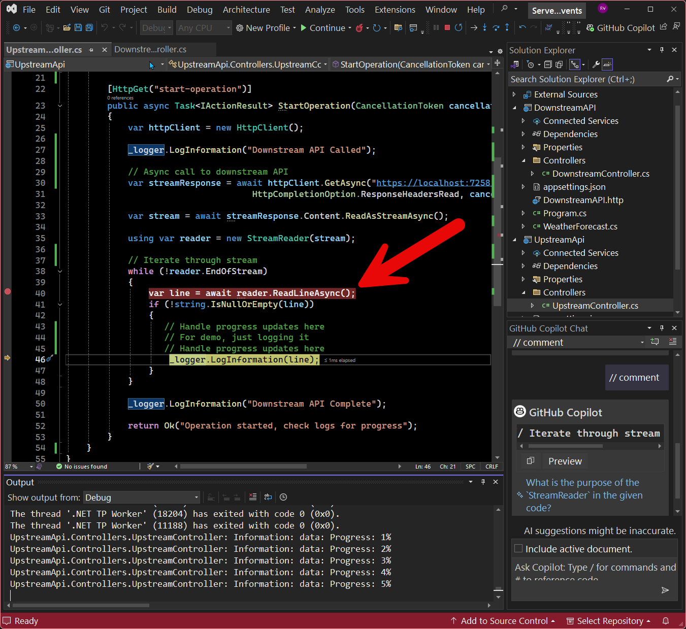
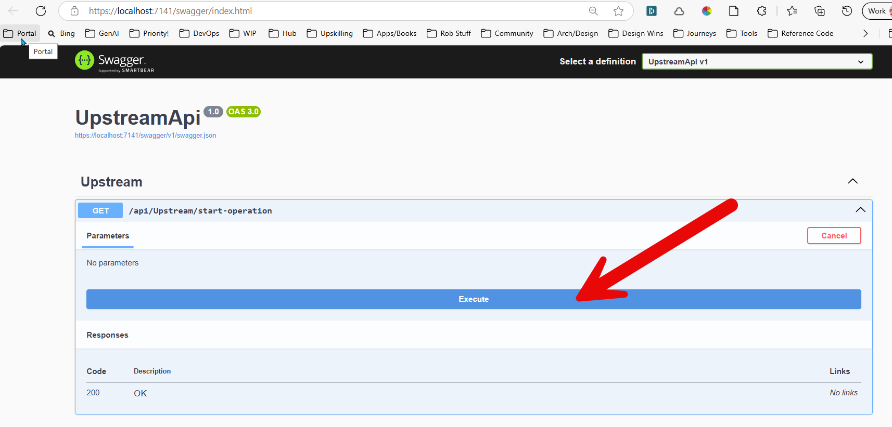

# Azure AISqlSense (Text-to-SQL) Service

### What is it?

Very simple .NET reference app to demonstrate Server-Side Events.

### Getting Started

1. There are two APIs: UpstreamAPI and DownstreamAPI, each in a separate .NET project.  

2. Open the UpstreamAPI project and place a breakpoint in the StartOperation endpoint on line 40, as shown in the picture.

    

3. Start debugging the solution (both projects are configured to start at once). Navigate to the Open API (Swagger) screen for UpstreamAPI, as show in the picture.

    

4. From the UpstreamAPI OpenAI (Swagger) screen, exectue the start-operation, which makes an Async call to the LongRunningOperaition endpoint on the DownstreamAPI.

5. Note how the long-running operation streams progress updates to the UpstreamAPI.

6. You would then stream those messages to the UX, preferrably over a Web Socket.

## License
MIT License
